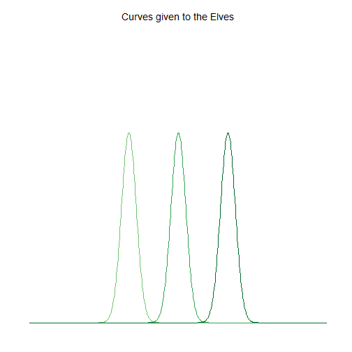
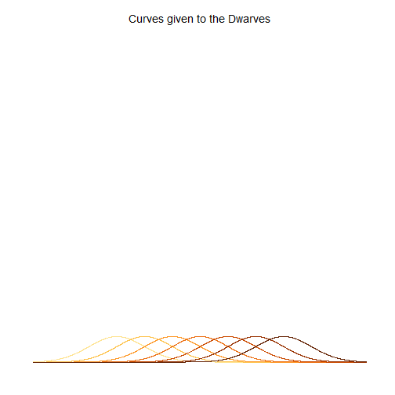
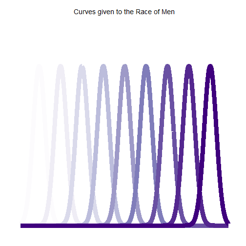
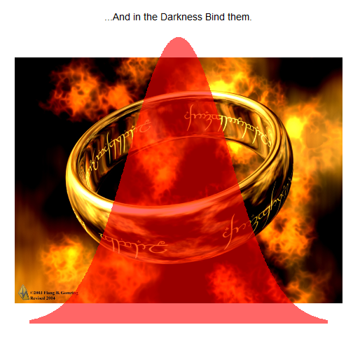
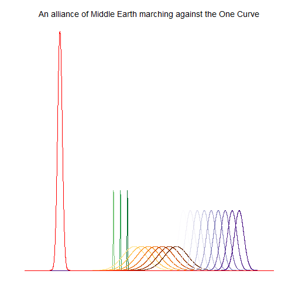
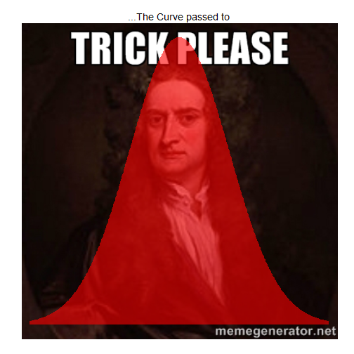

One Curve to Rule Them All...
========================================================
###By Omesh Johar, Lindsey Jackson, and Andee Kaplan

It began with the forging of the Curves of Normal. Three were given to the Elves; immortal, wisest and fairest of all beings.
 

Seven, to the Dwarf Lords, great data miners and graphsmen of the mountain halls. 

 

And nine--nine curves were gifted to the race of Men, who above all else desire power. For within these curves was bound the strength and the will to govern over each race. 

 

But they were all of them deceived, for a new curve was made. In the land of Moivre-dor, in the fires of **M o $\mu$ n t <sp></sp>D $\sigma\sigma$ m**, the Dark Lord Gausson forged in secret, a standard Normal curve, to control all others. And into this master curve he poured all his cruelty, his malice and his will to dominate all life. One curve to rule them all. 

 

One by one, the free peoples of Middle-earth fell to the power of the Curve. But there were some who resisted. A last alliance of men and elves marched against the armies of Moivre-dor, and on the very slopes of  **M o $\mu$ n t <sp></sp>D $\sigma\sigma$ m**, they fought for the freedom of Middle-earth. 

 

Victory was near, but the power of the Curve could not be undone. It was in this moment, when all hope had faded, that Sir Isaac Newton, son of the king, took up his father's gravity. And Gausson, enemy of the free peoples of Middle-earth, was defeated. The Curve passed to Sir Isaac Newton...

 

...who had this one chance to destroy evil forever, but the hearts of men are easily corrupted. And the curve of power has a will of its own. It betrayed Sir Isaac Newton, to his death. And some things that should not have been forgotten were lost. History became legend. Legend became myth. And for two and a half thousand years, the Curve passed out of all knowledge. Until, when chance came, the Curve ensnared every introductory Statistics student in Middle Earth. 

